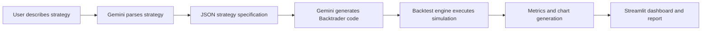

# AI Trading Strategy Backtester

Final Year Project: Natural-Language Trading Strategy Generation and Historical Backtesting

## Overview

AI Trading Strategy Backtester is a standalone Python project that allows a user to describe a trading strategy in plain English and evaluate it on historical market data. The system uses Gemini to parse the strategy, generate executable Backtrader code, fetch market data from Yahoo Finance, run a backtest, calculate performance metrics, and present an analyst-style report through a Streamlit dashboard.

This project is designed as a final-year academic submission because it combines artificial intelligence, financial data processing, automated code generation, simulation, and data visualization in one complete workflow.

## Problem Statement

Traditional backtesting tools require users to manually write strategy code, configure market data, run simulations, and interpret performance metrics. This creates a barrier for students, beginner traders, and non-programmers who want to test trading ideas quickly. The goal of this project is to reduce that barrier by using natural-language input and AI-assisted code generation.

## Objectives

- Convert plain-English trading rules into a structured machine-readable strategy specification.
- Generate valid Backtrader strategy code from the parsed specification.
- Fetch and prepare historical market data with technical indicators.
- Execute a reproducible backtest with configurable ticker, date range, and starting capital.
- Report key metrics such as return, Sharpe ratio, drawdown, win rate, and final portfolio value.
- Provide charts and a natural-language analyst report for easier interpretation.

## Key Features

- Streamlit web interface for interactive use.
- Gemini-based strategy parsing and code generation.
- Historical data collection through `yfinance`.
- Backtesting engine built with `backtrader`.
- Technical indicators including SMA, RSI, and MACD.
- Plotly chart output with downloadable HTML report.
- Modular folder structure suitable for academic explanation and future extension.

## Technology Stack

- Python 3.13
- Streamlit
- Google Gemini API
- Backtrader
- yfinance
- pandas
- Plotly
- python-dotenv
- pytest

## Project Structure

```text
trading-backtester/
  backtest/              Data loading and backtest execution
  codegen/               AI-assisted Backtrader code generation
  reporting/             Charts and analyst report generation
  strategy/              Natural-language strategy parser
  ui/                    Streamlit application
  docs/                  Final-year project documentation
  presets/               Reusable strategy templates
  demo/                  Offline demo mode (no API required)
  core/                  Shared config, Gemini client, pipeline
  output/                Generated charts and strategy cards
  main.py                CLI entry point
  config.py              Central configuration
  Dockerfile             Container deployment
  .github/workflows/     CI pipeline
  requirements.txt       Python dependencies
  .env.example           Environment variable template
```

## System Workflow



## Installation

1. Create and activate a virtual environment.

```powershell
python -m venv venv
venv\Scripts\Activate.ps1
```

2. Install dependencies.

```powershell
pip install -r requirements.txt
```

3. Create a `.env` file from the sample file.

```powershell
Copy-Item .env.example .env
```

4. Add your Gemini API key inside `.env`.

```text
GEMINI_API_KEY=your_api_key_here
```

## Running the Application

```powershell
streamlit run ui/app.py
```

Or use the CLI:

```powershell
python main.py ui
python main.py run "Buy when 50 SMA crosses 200 SMA. Sell when RSI > 70." --demo
python main.py walk "Buy when 50 SMA crosses 200 SMA. Sell when RSI > 70." --demo
```

**Demo Mode:** Enable in the sidebar (or pass `--demo` on CLI) to run the full pipeline without Gemini API calls — useful for viva demos and rate-limit situations.

## Sample Strategy

```text
Buy when 50-day SMA crosses above 200-day SMA. Sell when RSI goes above 70.
```

Suggested demo settings:

- Ticker: `^NSEI`
- Start date: `2019-01-01`
- End date: `2024-01-01`
- Initial capital: `100000`

## Evaluation Metrics

- Total Return: Percentage gain or loss from starting capital.
- Sharpe Ratio: Risk-adjusted return measure.
- Max Drawdown: Largest observed portfolio decline.
- Total Trades: Number of completed trade actions.
- Win Rate: Percentage of profitable trades.
- Final Value: Ending portfolio value after simulation.

## Testing

The project includes a basic automated test for the technical-indicator pipeline. Run tests with:

```powershell
pytest
```

## Academic Scope

This project is intended for research and educational use. It demonstrates how large language models can simplify quantitative strategy prototyping, but it does not provide financial advice or guarantee profitable trading results.

## Future Enhancements

- [x] Strategy templates and reusable presets
- [x] Buy-and-hold benchmark and alpha comparison
- [x] Walk-forward train/test validation
- [x] Multi-strategy comparison dashboard
- [x] Demo mode (offline, no API)
- [x] CLI entry point (`main.py`)
- [x] GitHub Actions CI and Docker support
- [ ] PDF report export
- [ ] Parameter sensitivity heatmaps
- [ ] Safer sandboxed code execution
- [ ] Persistent experiment history
