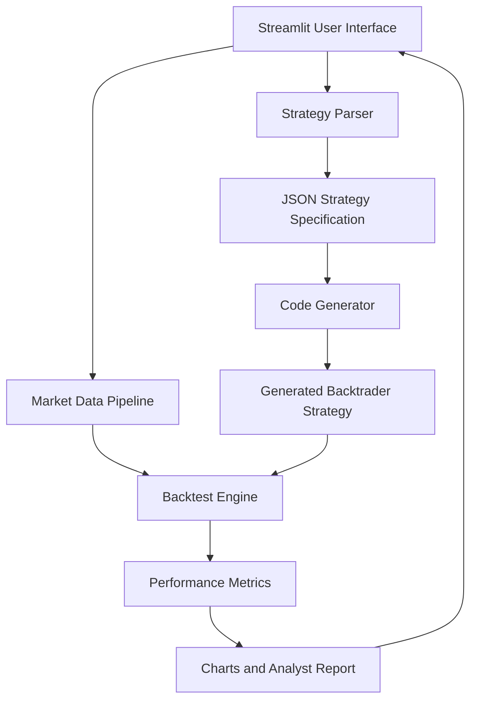

# Final Year Project Report

## Project Title

AI Trading Strategy Backtester: Natural-Language Strategy Generation and Historical Market Simulation

## Abstract

This project presents an AI-assisted trading strategy backtesting system that converts plain-English trading rules into executable Python strategy code. The system combines a large language model, historical financial data, technical indicators, and a Backtrader simulation engine to help users evaluate trading ideas without manually writing code. A Streamlit dashboard provides user input controls, generated strategy visibility, quantitative metrics, interactive charts, and an analyst-style explanation of results. The project demonstrates the practical integration of artificial intelligence with financial technology and decision-support systems.

## Introduction

Backtesting is an important process in quantitative finance because it allows a trader or researcher to test a strategy on historical data before risking real capital. However, most backtesting platforms require programming knowledge and manual setup. This project addresses that gap by allowing users to describe a strategy in natural language and automatically transforming that description into a runnable backtest.

## Problem Definition

Students and beginner traders often understand trading rules conceptually but may not be able to convert those rules into correct program code. Manual backtesting also requires data handling, indicator calculation, strategy execution, metric extraction, and report generation. The absence of a simple end-to-end workflow slows down experimentation and learning.

## Proposed System

The proposed system accepts a natural-language strategy, converts it into a structured JSON specification, generates Backtrader strategy code, fetches historical market data, runs a backtest, and reports the results in a web interface. The system is modular so that each component can be explained, tested, and extended independently.

## Modules

### Strategy Parser

The parser uses Gemini to convert user-provided strategy text into a JSON specification. This specification includes ticker, date range, entry indicator, exit indicator, stop-loss percentage, and position size.

### Code Generator

The code generation module converts the strategy specification into a Python `GeneratedStrategy` class compatible with Backtrader. It also retries generation when syntax errors are detected.

### Data Pipeline

The data module downloads historical OHLCV data using `yfinance`, prepares the datetime index, and calculates technical indicators such as SMA, RSI, and MACD.

### Backtest Engine

The engine runs the generated Backtrader strategy against historical data. It configures broker cash, commission, analyzers, and returns key performance metrics.

### Reporting Layer

The reporting module creates an interactive Plotly chart and uses Gemini to generate a concise analyst-style interpretation of the backtest results.

### User Interface

The Streamlit interface provides controls for ticker, date range, starting capital, strategy input, generated code display, result metrics, chart visualization, and downloadable chart output.

## Methodology

1. The user enters a strategy in plain English.
2. Gemini converts the description into a structured JSON strategy specification.
3. Gemini generates Backtrader-compatible Python code from the specification.
4. The system downloads historical market data for the selected ticker and date range.
5. Technical indicators are calculated on the market data.
6. Backtrader executes the generated strategy.
7. The system extracts performance metrics from Backtrader analyzers.
8. Plotly and Gemini generate the final visual and textual report.

## Architecture

## Expected Outcomes

- A working web application for natural-language trading strategy testing.
- Automated generation of Backtrader strategy code.
- Historical backtest results with meaningful financial metrics.
- Visual chart output and natural-language performance interpretation.
- A modular codebase suitable for extension and academic demonstration.

## Testing and Validation

The system includes automated validation for the indicator-generation pipeline using deterministic sample market data. The application also exposes generated JSON and Python code in the interface so that users and evaluators can inspect intermediate outputs before interpreting final results.

## Advantages

- Reduces the need for manual strategy coding.
- Makes backtesting more accessible to non-expert users.
- Combines AI, finance, data engineering, and visualization.
- Provides transparent generated code for review.
- Supports reproducible experimentation through ticker and date controls.

## Limitations

- The generated strategy depends on LLM output quality.
- Current code execution should be sandboxed further before production use.
- Backtest results do not guarantee future market performance.
- Yahoo Finance data availability can vary by ticker.
- The current implementation focuses on single-asset strategies.

## Future Scope

- Add PDF report generation for academic submission and record keeping.
- Implement safer execution isolation for AI-generated code.
- Support multiple assets and portfolio-level backtesting.
- Add additional indicators such as Bollinger Bands, ATR, ADX, and Supertrend.
- Store previous experiments in a database.
- Add walk-forward testing for stronger evaluation.

## Conclusion

The AI Trading Strategy Backtester demonstrates how natural-language interfaces and large language models can simplify financial strategy research. By combining AI parsing, automated code generation, market data processing, backtesting, and reporting, the project provides a complete final-year-level system that is both technically meaningful and practically demonstrable.
